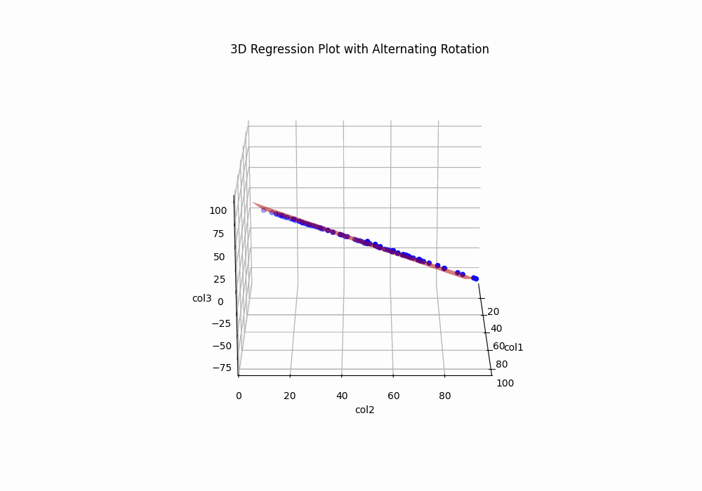

# Predictive Learning Model 2
```math
Surface\; of\; Regression\; View\; 1 \\[1em]
```

```math
Surface\; of\; Regression\; View\; 2 \\[1em]
```

## Overview

This folder contains **Predictive Learning Model 2**, a linear regression model that demonstrates predictive learning by identifying underlying patterns within structured data. The model is trained using a dataset where the dependent variable (col3) is a function of two independent variables (col1 and col2), although this relationship is not explicitly provided. The task showcases the fundamental strength of **linear regression** in learning linear dependencies between variables from data and applying them to make future predictions.

---

## Dataset

This directory `Predictive Learning Model 2` involves two datasets: 

1. `train_data.csv`: Used to train the linear regression model.  
2. `test_data.csv`: Used for testing and validating the trained model's predictions.

### Data Structure

- **col1**: First independent variable `feature`.
- **col2**: Second independent variable `feature`.
- **col3**: Dependent variable `target`.

### Implicit Relationship  
The data follows a hidden rule:  
```
col3 = col1 - col2
```

This relationship is **not explicitly mentioned** in the dataset. The task of the linear regression model is to **discover and learn** this relationship during the training phase, and use it to predict values of col3 for the test dataset.

---

## Model Overview

Linear regression is a **parametric supervised learning algorithm** that models the relationship between one or more independent variables $`X = \{x_1, x_2, \dots, x_n\}`$ and a dependent variable $`y`$. The goal is to find the **best-fitting linear equation** that minimizes the error between predicted and actual values.

The general formula for **multiple linear regression** is:
```math
y = \beta_0 + \beta_1 \cdot x_1 + \beta_2 \cdot x_2 + \dots + \beta_n \cdot x_n + \epsilon
```
Where:

- $`y`$: Dependent variable (in this case, **col3**).  
- $`x_1, x_2, \dots, x_n`$: Independent variables (here, **col1** and **col2**).  
- $`\beta_0`$: Intercept (the value of $`y`$ when all $`x_i = 0)`$.  
- $`\beta_1, \beta_2, \dots, \beta_n`$: Coefficients (weights) for each independent variable, which determine the contribution of each feature to the target.  
- $`\epsilon`$: Error term representing the residuals (noise).

The model finds the optimal coefficients $`\beta_0, \beta_1,`$ and $`\beta_2`$ by **minimizing the sum of squared residuals (SSR)**. This is done using **Ordinary Least Squares (OLS)**, which solves:
```math
\min_{\beta} \sum_{i=1}^{n} \left( y_i - \hat{y}_i \right)^2
```
Where:
- $`y_i`$: Actual value of the dependent variable.  
- $`\hat{y}_i`$: Predicted value from the model.  

---

## Files in This Folder

- `train_data.xlsx`: Dataset used for training the model.  
- `test_data.xlsx`: Dataset used for testing and validating the model.  
- `linear_prediction.py`: Python script containing the code to train the model, make predictions, and evaluate performance.
- `model_application.py`: Python script containing the code to use model on the base of the saved model
- `model_plot_all_direction.py`: Python script containing the code that generates and saves the Surface of Regression `SOR` and showcasing in all directions in form of (`.gif`)
- `model_plot_bi_direction.py`: Python script containing the code that generates and saves the Surface of Regression `SOR` and showcasing 2 alternating directions in form of (`.gif`)
- `linear_regression_model.pkl`: Trained model, serialized and saved using **Pickle** to allow reuse without re-training.

---

## Workflow and Code Execution

### Prerequisites
Make sure you have the following Python libraries installed:
```bash
pip install pandas scikit-learn openpyxl
```

### Steps to Execute

1. **Training the Model**:
   - Run `linear_prediction.py` to load **train_data.xlsx** and train the linear regression model.
   - During training, the model estimates the coefficients $`\beta_0, \beta_1,`$ and $`\beta_2`$ using the OLS method.
   - The trained model is then saved as **linear_regression_model.pkl** for future use.
2. **Not using the Pre-Trained Model**:
   - If you want to re-train, use the following command to run the script:
     ```bash
     py linear_prediction.py
     ```
     or
     ```bash
     python linear_prediction.py
     ```
3. **Using the Pre-Trained Model**:
   - If you don’t want to re-train, use the **linear_regression_model.pkl** file to directly predict values for the test dataset, see 4th (below) point

4. **Running the Prediction Script on basis of Trained Model**:
   - Use the following command to run the script:
     ```bash
     py model_application.py
     ```
     or
     ```bash
     python model_application.py
     ```
   - The script loads **test_data.xlsx**, applies the trained model, and predicts values for **col3**.

---

## Model Evaluation and Metrics

### 1. Mean Squared Error (MSE)  
MSE is a common metric for regression models that measures the average squared difference between actual and predicted values.  
```math
\text{MSE} = \frac{1}{n} \sum_{i=1}^{n} \left( y_i - \hat{y}_i \right)^2
```
A lower MSE indicates better model performance.

### 2. Root Mean Squared Error (RMSE)  
RMSE is the square root of MSE, providing a more interpretable error metric in the same unit as the target variable:
```math
\text{RMSE} = \sqrt{\text{MSE}}
```

### 3. R² Score (Coefficient of Determination)  
The R² score measures how well the independent variables explain the variance in the dependent variable:
```math
R^2 = 1 - \frac{\sum_{i=1}^{n} \left( y_i - \hat{y}_i \right)^2}{\sum_{i=1}^{n} \left( y_i - \bar{y} \right)^2}
```
Where:
- $`y_i`$: Actual values of the target variable.
- $`\hat{y}_i`$: Predicted values from the model.
- $`\bar{y}`$: Mean of actual values.

An **R² score close to 1** indicates that the model captures most of the variability in the data, while a value close to 0 indicates poor performance.

---

## Python Code Overview (linear_prediction.py)

The **linear_prediction.py** script follows these steps:

1. **Importing Libraries**:
   - `pandas`: For data handling and loading Excel files.
   - `sklearn.linear_model`: For implementing the Linear Regression algorithm.
   - `pickle`: For saving and loading the trained model.

2. **Data Loading**:
   - Load `train_data.xlsx` and `test_data.xlsx` using `pandas`.

3. **Model Training**:
   - Use `LinearRegression()` from **scikit-learn** to train the model.
   - Fit the model to the training data and extract the coefficients $`\beta_0, \beta_1,`$ and $`\beta_2`$.

4. **Model Serialization**:
   - Save the trained model as **linear_regression_model.pkl** using `pickle`.

5. **Prediction**:
   - Load the pre-trained model and apply it to the test dataset to predict **col3**.

6. **Evaluation**:
   - Calculate **MSE**, **RMSE**, and **R²** score to assess the model’s performance.

---

## Conclusion

This project demonstrates the use of **linear regression** to uncover hidden linear relationships in data. By learning the relationship $`\text{col3} = \text{col1} + \text{col2}`$, the model accurately predicts future values, showcasing the predictive power of linear models. 

The workflow highlights how **data preprocessing, model training, serialization, and evaluation** are carried out in a practical machine learning project.

---

## Folder Structure

- `train_data.xlsx`: Training dataset.  
- `test_data.xlsx`: Testing dataset.  
- `linear_prediction.py`: Python script for training, predicting, and evaluating the model.  
- `linear_regression_model.pkl`: Serialized model for reuse.  
- `README.md`: This file, providing a comprehensive overview of the project.
- `model_application.py`: Python script containing the code to use model without re-trainning
- `model_plot_all_direction.py`: Python script containing the code that generates and saves `SOR` in (`.gif`) format
- `model_plot_bi_direction.py`: Python script containing the code that generates and saves `SOR` in (`.gif`) format


---

## License

This project is licensed under the [Apache License - Version 2.0, January 2004](LICENSE). Feel free to use, modify, and distribute the content as needed, giving appropriate credit.

---

Explore the code and datasets to understand how linear regression works, and feel free to contribute improvements or new ideas.
